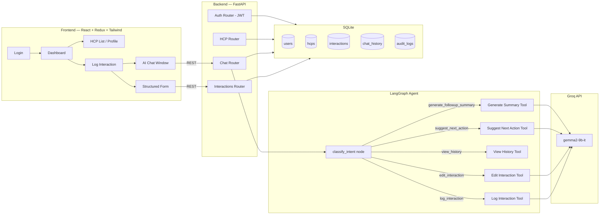

# AI-First CRM — HCP Interaction Module

An AI-first CRM module for pharmaceutical field representatives to log, edit, and
analyze Healthcare Professional (HCP / doctor) interactions — either through a
structured form or a conversational AI chat interface powered by **LangGraph** and
**Groq (gemma2-9b-it)**.

Built for the Round 1 technical assignment: *AI-First CRM HCP Module — Log
Interaction Screen*.

---

## 1. Architecture



**Flow for the conversational path:** the chat message hits `POST /api/chat/message`,
which invokes a compiled `langgraph.graph.StateGraph`. The graph's entry node calls
Groq to classify intent into one of five categories, then conditionally routes to the
matching tool node. `log_interaction` runs entity extraction + drafts a record and
returns it to the UI for **human-in-the-loop confirmation** before anything is
persisted (`POST /api/chat/confirm`). The other four tools execute against the
database directly and return their result inline.

---

## 2. Tech Stack

| Layer     | Technology |
|-----------|------------|
| Frontend  | React (Vite), Redux Toolkit, React Router, Tailwind CSS, React Hook Form, Axios, Google Inter font |
| Backend   | Python, FastAPI, SQLAlchemy, Pydantic |
| AI Agent  | LangGraph (real `StateGraph`, not a simulated dispatcher) |
| LLM       | Groq — `gemma2-9b-it` (primary), `llama-3.3-70b-versatile` (fallback on repeated failure) |
| Database  | SQLite |
| Auth      | JWT (python-jose + passlib/bcrypt) |

---

## 3. LangGraph Agent & Tools

The agent's job is to sit between free-text rep input and the CRM database: it
decides **what the rep is trying to do**, then delegates to a specialized tool
rather than trying to do everything in one giant prompt. This keeps each tool's
prompt focused and makes behavior debuggable/testable in isolation.

| # | Tool | Responsibility |
|---|------|-----------------|
| 1 | **Log Interaction** | Summarizes the conversation, extracts doctor/hospital/specialty/city/products/follow-up/sentiment/outcome via a structured-JSON Groq call, and returns a draft for the rep to confirm before saving. |
| 2 | **Edit Interaction** | Parses a free-text correction ("actually he wants literature, not a demo") into a partial update, applies it to the existing `Interaction` row, and regenerates its summary. |
| 3 | **View Interaction History** | Looks up an HCP (with search/filter by name or city) and returns their full visit timeline. |
| 4 | **Suggest Next Action** | Reads the HCP's latest interaction outcome/sentiment and asks Groq for one concrete next step (e.g. interested → schedule demo, busy → follow up in 2 weeks, requested literature → send brochure). |
| 5 | **Generate Follow-up Summary** | Aggregates the last 5 visits for an HCP into a structured CRM report: previous visit, discussion, products, objections, action items. |

All Groq calls go through `app/llm/groq_client.py`, which forces JSON-mode
responses, validates they parse, and retries with the larger `llama-3.3-70b-versatile`
model if `gemma2-9b-it` returns malformed output twice in a row.

---

## 4. Folder Structure

```
backend/
  app/
    core/         # settings, JWT/password utilities
    database/     # SQLAlchemy engine/session
    models/       # Users, HCP, Interaction, ChatHistory, AuditLog
    schemas/      # Pydantic request/response models
    routers/      # auth, hcps, interactions, chat
    services/     # audit logging, HCP get-or-create
    graph/        # LangGraph StateGraph + state schema
      tools/      # the 5 tool implementations
    llm/          # Groq client wrapper (retries, JSON validation)
    prompts/      # reusable versioned prompt templates
    main.py
  requirements.txt
  Dockerfile

frontend/
  src/
    components/
      layout/     # Sidebar, Topbar, AppLayout
      interaction/# structured form
      chat/       # AI chat window
      hcp/        # timeline
      common/     # Modal, ConfirmDialog, Skeleton, EmptyState
    pages/        # Login, Dashboard, HCPList, HCPProfile, LogInteraction
    redux/slices/ # auth, hcp, interactions, chat, theme, ui
    services/     # axios instance
  Dockerfile

docker-compose.yml
```

---

## 5. Running the Project

### Option A — Docker Compose (recommended)

```bash
cp backend/.env.example backend/.env
# edit backend/.env and set GROQ_API_KEY

docker compose up --build
```

- Frontend: http://localhost:5173
- Backend docs (Swagger): http://localhost:8000/docs

### Option B — Manual

**Backend**
```bash
cd backend
python -m venv venv && source venv/bin/activate
pip install -r requirements.txt
cp .env.example .env   # set GROQ_API_KEY and DATABASE_URL
uvicorn app.main:app --reload
```

**Frontend**
```bash
cd frontend
npm install
cp .env.example .env   # VITE_API_BASE_URL=http://localhost:8000
npm run dev
```

---

## 6. Environment Variables

**backend/.env**
```
DATABASE_URL=sqlite:///./hcp_crm.db
JWT_SECRET_KEY=change_this_to_a_random_secret_string
JWT_ALGORITHM=HS256
ACCESS_TOKEN_EXPIRE_MINUTES=1440
GROQ_API_KEY=your_groq_api_key_here
GROQ_MODEL=gemma2-9b-it
GROQ_FALLBACK_MODEL=llama-3.3-70b-versatile
ENVIRONMENT=development
CORS_ORIGINS=http://localhost:5173
```

**frontend/.env**
```
VITE_API_BASE_URL=http://localhost:8000
```

---

## 7. API Reference (summary)

Full interactive docs at `/docs` once the backend is running. Key endpoints:

| Method | Path | Description |
|--------|------|-------------|
| POST | `/api/auth/register` | Create account, returns JWT |
| POST | `/api/auth/login` | Login, returns JWT |
| GET | `/api/hcps` | List/search/filter HCPs (paginated) |
| POST | `/api/hcps` | Create HCP |
| GET | `/api/hcps/{id}` | HCP detail |
| POST | `/api/interactions` | Log interaction via structured form |
| GET | `/api/interactions` | List interactions (filter by `hcp_id`) |
| PATCH | `/api/interactions/{id}` | Edit interaction (direct structured update) |
| POST | `/api/chat/message` | Send a message to the LangGraph agent |
| POST | `/api/chat/confirm` | Confirm & persist an AI-extracted draft |
| POST | `/api/chat/edit/{interaction_id}` | Edit Interaction tool — used by the timeline's Edit modal (see §3, §9) |
| GET | `/api/chat/next-action/{hcp_id}` | Suggest Next Action tool |
| GET | `/api/chat/followup-summary/{hcp_id}` | Generate Follow-up Summary tool |

---

## 8. Screenshots

_Add screenshots/GIFs here after running the app locally: Login, Dashboard, Log
Interaction (form + chat), HCP Profile with timeline._

---

## 9. Edit Interaction (Timeline)

Every interaction card in the HCP profile timeline (`components/hcp/Timeline.jsx`)
has an **edit (pencil) icon**. Clicking it opens `EditInteractionModal.jsx` with four
editable fields: **Notes**, **Products Discussed**, **Follow-up Date**, **Outcome**.

Rather than adding a new REST endpoint, the modal reuses the existing **Edit
Interaction LangGraph tool** — it turns the field edits into a plain-language
instruction and posts it to `POST /api/chat/edit/{interaction_id}`, the same
endpoint/tool described in §3. That tool parses the instruction with Groq,
updates the row in SQLite, and regenerates the interaction's summary.

On success:
- The timeline re-fetches (`GET /api/interactions?hcp_id=...`) so the updated card
  renders immediately.
- A success toast (`react-hot-toast`) confirms the save.
- On failure, an error toast shows instead and the modal stays open.

**Note:** the `follow_up_date` string returned by Groq is parsed into a real
`datetime` object in `edit_interaction_tool.py` before being written to the
SQLite `DateTime` column — SQLite's SQLAlchemy dialect rejects raw strings for
that column type, which previously caused a 500 on any edit that touched the
follow-up date.

---

## 10. Future Improvements

- Streaming token-by-token responses from Groq in the chat UI
- Multi-turn slot-filling when extraction is incomplete (ask a follow-up question
  instead of failing silently)
- Role-based access control (rep vs manager dashboards)
- Vector search over interaction notes for semantic HCP lookup
- Alembic migrations instead of `create_all` for schema changes
